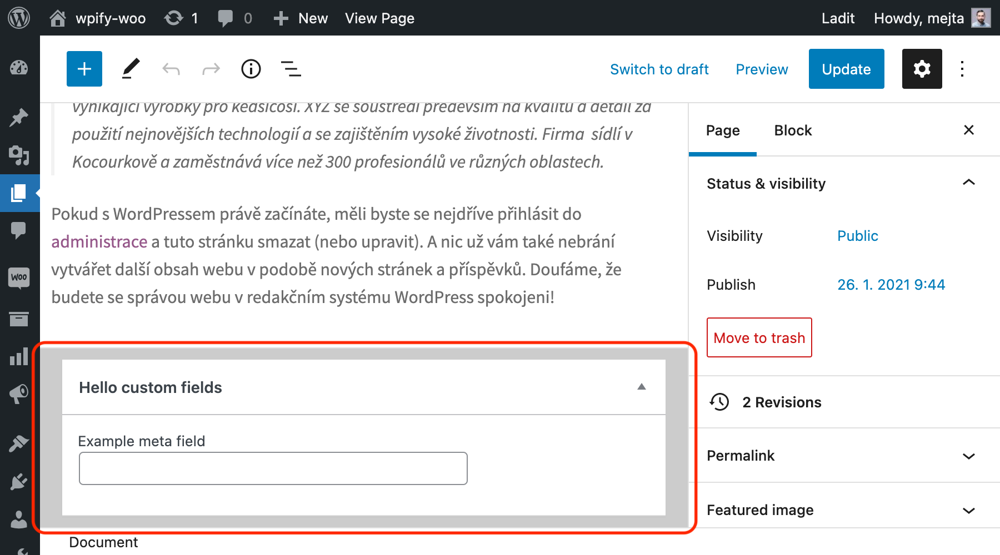
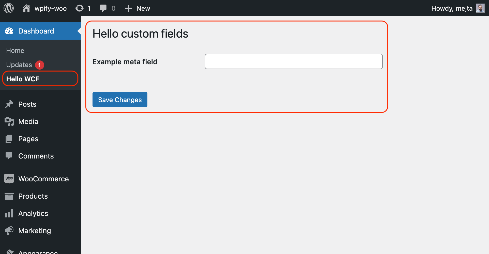
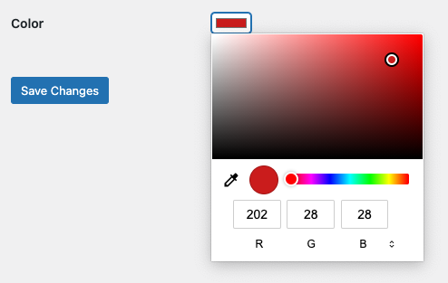

# WPify Custom Fields

This library provides custom fields for WordPress and WooCommerce via simple API. The custom fields are stored in plain
meta data, so you can access them via standard WordPress functionality. The frontend is written in React.js and have no
dependencies in PHP. The library also doesn't include React itself, but uses react as a dependency from the WordPress.
Therefore, the library is small and fast, but requires at least WordPress 5.2.

[[_TOC_]]

## Overview

At the moment, you can add custom fields to the following locations:

* Post
* Taxonomy
* Options page
* WooCommerce product options
* WooCommerce settings section

The custom fields itself uses the standard HTML inputs, so it's recommended to use Google Chrome or Firefox to use the
custom fields. This allows having a small footprint and speedy frontend for the custom fields. You have available wide
variety of the custom field types:

* Attachment `attachment`: Files and images from Media library.
* Checkbox `checkbox`
* Code `code`: For css, javascript, html, php, and other dialects.
* Color `color`
* Date `date`
* Datetime `datetime`
* Email `email`
* Group `group`: To save multiple custom fields in one object.
* HTML `html`: To print some piece of HTML in the settings.
* Month `month`
* Number `number`
* Password `password`
* Post `post`: To select any post from any post type.
* Select `select`: Searchable select field.
* Phone number `tel`: The phone number input that enforces the user to put the standardised phone number in an
  international format.
* Textarea `textarea`
* Text `text`
* Time `time`
* Title `title`: To print the section title in the settings.
* Toggle `toggle`
* URL `url`
* Week `week`

Some fields also allows multiple values. You can also sort the values via drag&drop.

* Multiple Attachments `multi_attachment`
* Multiple Groups `multi_group`: The repeater that allows you to have any custom fields repeaded inside a group.
* Multiple Posts `multi_post`: Select multiple posts.
* Multiple Select `multi_select`: Select multiple values.

### Requirements

* PHP 7.3+ (we support only versions with security patches)
* Google Chrome/Firefox (the library uses native input fields that only some browsers support)
* WordPress 5.2 (the library requires React 16.8+ that was included in WordPress 5.2)

### Development requirements

If you want to help with development of the library, feel free to extend that. In addition to requirements above, you
will need also:

* Composer 2+
* Node 14+

## Example: Hello custom fields

The following example shows you how to add a custom fields to page and how to read the data.

1. Require the library in your plugin via composer:
   `composer require wpify/custom-fields`

2. Include composer autoloader in your plugin:
   `include_once __DIR__ . '/vendor/autoload.php';`

3. Create a new metabox with some text field:

```php
get_wpify_custom_fields()->add_metabox( array(
	// Metabox title
	'title'      => 'Hello custom fields',
	// Array of post types that will have the custom fields
	'post_types' => array( 'page' ),
	// Array of items for the metabox
	'items'      => array( 
		// Text field
		array(
			'type'  => 'text',
			'title' => 'Text label of the meta',
			'id'    => 'some_id_of_the_meta',
		),
	),
) );
```

That's it :)

## How to add custom fields to post type?



The example above shows the minimalistic example of how to add a metabox. Let's extend that with full list of options.
In snippet above, you can see all the options with their default values:

```php
get_wpify_custom_fields()->add_metabox( array(
	'id'            => null,
	'title'         => null,
	'screen'        => null,
	'context'       => 'advanced',
	'priority'      => 'default',
	'callback_args' => null,
	'items'         => array(),
	'post_types'    => array(),
) );
```

### Arguments

* `id`, `title`, `screen`, `context`, `priority` and `callback_args`: See the WordPress documentation of `add_meta_box` function.
* `items`: array, required: List of the custom fields in the metabox.
* `post_types`: array, required: List of the post types that will have custom fields.

Please keep in mind, that to have a custom fields in the post type. For custom post type, add `custom-fields`
in `supports` array in `register_post_type` function, or use `add_post_type_support` function to add support to some
existing post type.

### Reading the custom fields

To read the data, you can use simply built-in functions:

```php
$some_custom_field_value = get_post_meta( $post_id, 'some_id_of_the_meta', true );
```

### Links

* `add_meta_box`: https://developer.wordpress.org/reference/functions/add_meta_box/
* `register_post_type`: https://developer.wordpress.org/reference/functions/register_post_type/
* `add_post_type_support`: https://developer.wordpress.org/reference/functions/add_post_type_support/
* `get_post_meta`: https://developer.wordpress.org/reference/functions/get_post_meta/

## How to add custom fields to taxonomy term?


The functionality adds the meta box both on add and edit screen of taxonomy term:

```php
get_wpify_custom_fields()->add_metabox( array(
	'taxonomy' => null,
	'items'    => array(),
) );
```

### Arguments

* `taxonomy` string, required. The taxonomy, to which terms you want to add a custom fields, e.g. `category` for post category or `product_cat` for WooCommerce product category.
* `items`: array, required: List of the custom fields in the term.

### Reading the custom fields

To read the data, you can use simply built-in functions:

```php
$some_custom_field_value = get_term_meta( $term_id, 'some_id_of_the_meta', true );
```

### Links

* `get_term_meta`: https://developer.wordpress.org/reference/functions/get_term_meta/

## How to create an options page with custom fields?



With this library, you can create a options pages with ease on the top or second level. There are used core function `add_menu_page` or `add_submenu_page` under the hood.

```php
get_wpify_custom_fields()->add_options_page( array(
	'type'        => 'normal',
	'parent_slug' => null,
	'page_title'  => '',
	'menu_title'  => '',
	'capability'  => 'manage_options',
	'menu_slug'   => null,
	'icon_url'    => null,
	'position'    => null,
	'items'       => array(),
) );
```

### Arguments

* `type`: The only allowed value is `normal` (for standard option page) at the moment.
* `parent_slug`: If the option page is top-level, leave that `null`. If you want to add the page on second-level, add here the top-level page slug, e.g.:
  * `index.php` for Dashboard,
  * `edit.php` for Posts,
  * `upload.php` for Media,
  * `edit.php?post_type=page` for Pages,
  * `edit-comments.php` for Comments,
  * `edit.php?post_type=your_post_type` for your customs post types,
  * `themes.php` for Appearance,
  * `plugins.php` for Plugins,
  * `users.php` for Users,
  * `tools.php` for Tools,
  * `options-general.php` for Settings,
  * `settings.php` for Network Settings,
  * `woocommerce` for WooCommerce,
  * or any your custom top-level menu slug.
* `page_title`: Title of the settings page.
* `menu_title`: Title of the settings page in the menu.
* `capability`: The capability the user needs to see the page.
* `menu_slug`: Unique menu slug of the page.
* `icon_url`: Icon for the top-level menu. Please see the documentation of `add_menu_page` to see how to add a menu icon.
* `position`: Position of the top-level menu page. Please see the documentation of `add_menu_page`.
* `items`: array, required: List of the custom fields in the options.

### Reading the custom fields

```php
$some_custom_field_value = get_option( 'some_id_of_the_option' );
```

### Links

* `add_submenu_page`: https://developer.wordpress.org/reference/functions/add_submenu_page/
* `add_menu_page`: https://developer.wordpress.org/reference/functions/add_menu_page/
* `get_option`: https://developer.wordpress.org/reference/functions/get_option/

## How to add custom fields to WooCommerce settings?


If you want to easily add the settings tab or section to the WooCommerce → Settings, you can easily do that with the following piece of code:

```php
get_wpify_custom_fields()->add_woocommerce_settings( array(
	'tab'     => array( 'id' => '', 'label' => null ),
	'section' => array( 'id' => '', 'label' => null ),
	'items'   => array(),
) );
```

### Arguments

* `tab`: Identification of the tab. Please provide an array with `id` and `label` keys. If the tab doesn't exists, it will be created.
* `section`: Identification of the section. Please provide an array with `id` and `label` keys. If the section doesn't exists, it will be created.
* `items`: array, required: List of the custom fields in the settings.

### Reading the settins fields.

The WooCommerce settings is stores as standard options and you can read it as follows:

```php
$some_custom_field_value = get_option( 'some_id_of_the_option' );
```

### Links

* `get_option`: https://developer.wordpress.org/reference/functions/get_option/

## How to add custom fields to the product options?


Product options is a great place where to put the custom fields. You can define it as follows:

```php
get_wpify_custom_fields()->add_woocommerce_settings( array(
	'tab'        => array(
		'id'       => 'general',
		'label'    => null,
		'priority' => 100,
		'class'    => array(),
	),
	'items'   => array(),
) );
```

### Arguments

* `tab`: An array with tab settings. If the tab ID doesn't exist, it will be created.
  - `id`: ID of the tab.
  - `label`: Label of the tab.
  - `priority`: Priority of the tab.
  - `class`: Classes for the tab. You can use any classes you want, but also some built-in: `hide_if_grouped`, `show_if_simple`, `show_if_variable`, `show_if_grouped`, `show_if_external`, `hide_if_external`, `hide_if_virtual`
* `items`: array, required: List of the custom fields in the options.

### Reading the custom fields

The product options are stored as post meta, so you can read the data the same way as any other post meta:

```php
$some_custom_field_value = get_post_meta( $product_id, 'some_id_of_the_meta', true );
```

### Links

* `get_post_meta`: https://developer.wordpress.org/reference/functions/get_post_meta/

# Custom fields definition

In examples above, only one custom field were shown. But you can define more than just text fields. There are many field types to use. All the fields has some the following attributes in common:

```php
$some_item = array(
	'type'              => '',
	'id'                => '',
	'title'             => '',
	'placeholder'       => '',
	'suffix'            => '',
	'custom_attributes' => array(),
	'description'       => '',
);

// Some dummy usage, use `add_*` methods listed above.
get_wpify_custom_fields()->add_some_custom_field_implementation( array(
	// some options
	'items'    => array( $some_item ),
) );
```

## Common attributes

* `type`: Field type identification, e.g. `text`, `date` or `attachmnent`.
* `id`: Unique ID of the item. This ID will be directly used as a name of the meta field.
* `title`: Title that will be used as a label of the field.
* `placeholder`: Placeholder that will be shown if the value is not filled.
* `suffix`: Text behind the field.
* `custom_attributes`: array of custom attributes you want to add to the field.
* `description`: Description that will be shown bellow the field.

## Attachment field type


### Field types

* `attachment`: Single attachment
* `multi_attachment`: Multiple attachments

### Additional attributes

* `attachment_type`: Optional type of the attachments. It can be e.g. `image`, `image/png`, etc.

## Checkbox field type


### Field types

* `checkbox`: Checkbox with label.

### Additional attributes

* `label`: Optional label behind the checkbox.

## Code editor field type


### Field types

* `code`

### Additional attributes

* `mode`: Mode of code editor for highlights, e.g. `css`, `javascript`, `html`, `php`, `markdown`, etc.

## Color field type



### Field types

* `color`

## Date field type


### Field types

* `date`

## Date and time field type


### Field types

* `datetime`

## E-mail field type

### Field types

* `email`

## Group field type

### Field types

* `group`
* `multi_group`

## HTML field type

### Field types

* `html`

## Month field type

### Field types

* `month`

## Number field type

### Field types

* `number`

## Password field type

### Field types

* `password`

## Post field type

### Field types

* `post`
* `multi_post`

## Select field type

### Field types

* `select`
* `multi_select`

## Phone number field type

### Field types

* `tel`

## Textarea field type

### Field types

* `textarea`

## Text field type

### Field types

* `text`

## Time field type

### Field types

* `time`

## Title field type

### Field types

* `title`

## Toggle field type

### Field types

* `toggle`

## URL field type

### Field types

* `url`

## Week field type

### Field types

* `week`

